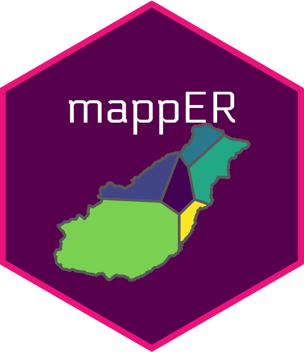

<!-- README.md is generated from README.Rmd. Please edit that file -->

```{r, include = FALSE}
knitr::opts_chunk$set(
  collapse = TRUE,
  comment = "#>",
  fig.path = "man/figures/README-",
  out.width = "100%"
)
```

# mappER  

<!-- badges: start -->
[](https://cran.r-project.org/web/licenses/GNU General Public License)
[](https://github.com/JonPayneEA/mappER)
[](https://github.com/JonPayneEA/mappER/commits/master)
<!-- badges: start -->

The `mappER` library is part of the `flode` collection of tools. It provides all the mapping functionality required for developing flood forecast models.

## Installation

You can install the development version of mappER from [GitHub](https://github.com/) with:

``` r
# install.packages("devtools")
devtools::install_github("JonPayne88/mappER")
```

## Example 1 - Collating spatial data

Datasets of class `HydroImport` or `HydroAggs` derived from the `riskyData` can be compiled into a shapefile.

```{r getCoords}
library(mappER)
library(riskyData)
data(crowle); data(bickley); data(barnhurst); data(hollies); data(ledbury);
data(bettwsYCrwyn)
gcs <- getCoords(crowle,
                 bickley,
                 barnhurst,
                 hollies,
                 ledbury,
                 bettwsYCrwyn)
gcs
```

These can be integrated into interactive plots with leaflet.

Example 2 - Thiessen polygons and calculate catchment Proportions

```{r}
# Import catchment polygon
data("bewdCatch")

# Calculate Voronoi/Thiessen polygon
bewdTeeSun <- teeSun(gaugeCoords = gcs, catchment = bewdCatch)
```

```{r, echo = FALSE}
par(mfrow = c(2,1))
plot(bewdCatch, main = "Bewdley subcatchment")
plot(bewdTeeSun, main = "Bewdley Thiessen polygons")
```

Intersect the catchment polygon with the Thiessen polygons;

```{r}
int <- intersectPoly(coords = gcs,
                     voronoi = bewdTeeSun,
                     catchment = bewdCatch)
plot(int, max.plot = 1, main = "Intersected catchment polygon")
```

From this we can calculate the gauge proportions with the `gaugeProp()` function;

```{r}
gaugeProp(gcs, bewdCatch)
```

These can then be inserted into rain gauge catchment averaging equations.

