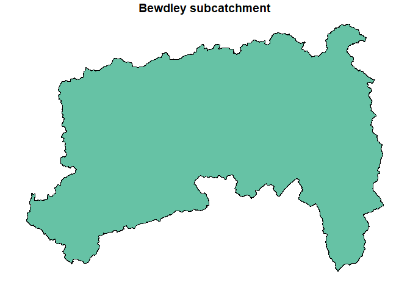
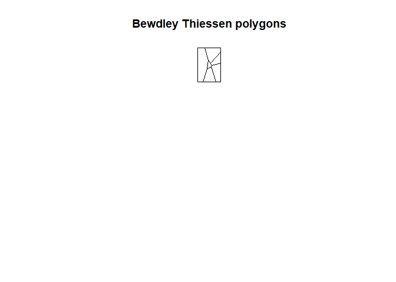
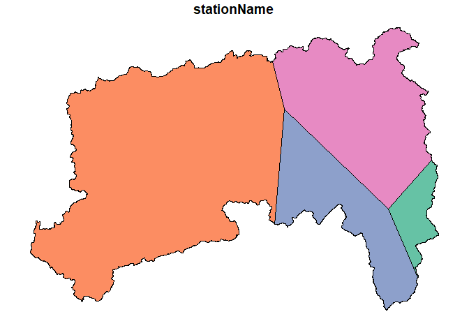

<!-- README.md is generated from README.Rmd. Please edit that file -->

# mappER 

<!-- badges: start -->

[](https://cran.r-project.org/web/licenses/GNU%20General%20Public%20License)
[](https://github.com/JonPayneEA/mappER)
[](https://github.com/JonPayneEA/mappER/commits/master)
<!-- badges: start -->

The `mappER` library is part of the `flode` collection of tools. It
provides all the mapping functionality required for developing flood
forecast models.

## Installation

You can install the development version of mappER from
[GitHub](https://github.com/) with:

``` r
# install.packages("devtools")
devtools::install_github("JonPayne88/mappER")
```

## Example 1 - Collating spatial data

Datasets of class `HydroImport` or `HydroAggs` derived from the
`riskyData` can be compiled into a shapefile.

``` r
library(mappER)
library(riskyData)
data(crowle); data(bickley); data(barnhurst); data(hollies); data(ledbury);
data(bettwsYCrwyn)
gcs <- getCoords(crowle,
                 bickley,
                 barnhurst,
                 hollies,
                 ledbury,
                 bettwsYCrwyn)
gcs
#> Simple feature collection with 6 features and 4 fields
#> Geometry type: POINT
#> Dimension:     XY
#> Bounding box:  xmin: -3.172591 ymin: 52.0317 xmax: -2.097173 ymax: 52.7993
#> Geodetic CRS:  WGS 84
#>      stationName  WISKI Easting Northing                   geometry
#> 1         Crowle 457592  393455   255757     POINT (-2.097173 52.2)
#> 2        Bickley 445031  363130   271330 POINT (-2.542565 52.33879)
#> 3      Barnhurst 091266  389910   301620  POINT (-2.15044 52.61225)
#> 4        Hollies 091862  381586   322452  POINT (-2.274545 52.7993)
#> 5        Ledbury 459793  370233   237123  POINT (-2.435301 52.0317)
#> 6 Bettws-Y-Crwyn 441011  320360   281360  POINT (-3.172591 52.4244)
```

These can be integrated into interactive plots with leaflet.

Example 2 - Thiessen polygons and calculate catchment Proportions

``` r
# Import catchment polygon
data("bewdCatch")

# Calculate Voronoi/Thiessen polygon
bewdTeeSun <- teeSun(gaugeCoords = gcs, catchment = bewdCatch)
```



Intersect the catchment polygon with the Thiessen polygons;

``` r
int <- intersectPoly(coords = gcs,
                     voronoi = bewdTeeSun,
                     catchment = bewdCatch)
plot(int, max.plot = 1, main = "Intersected catchment polygon")
```



From this we can calculate the gauge proportions with the `gaugeProp()`
function;

``` r
gaugeProp(gcs, bewdCatch)
#>             Gauge  WISKI    Area Proportion
#> 1: Bettws-Y-Crwyn 441011 2465.18  57.127827
#> 2:        Hollies 091862 1050.89  24.353217
#> 3:        Bickley 445031  632.26  14.651928
#> 4:      Barnhurst 091266  166.87   3.867028
```

These can then be inserted into rain gauge catchment averaging
equations.
